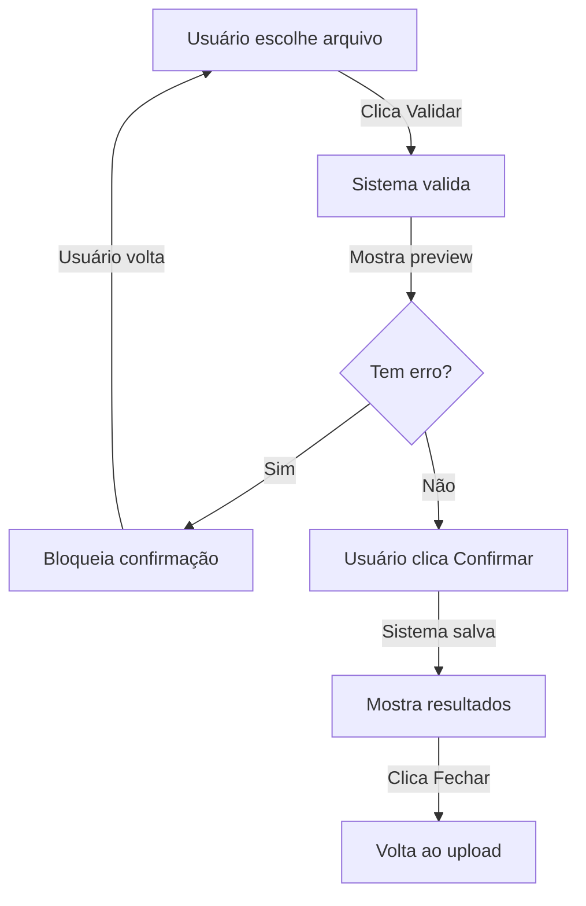

# ⚡ QUICK START - UX de Importação

## 📋 O que foi entregue

Uma **experiência completa de importação de convidados** com 3 etapas:

```
Upload → Preview → Confirmação
```

---

## 🎯 Arquivos Criados

### Componentes (4 arquivos)
```
✨ app/components/GuestImportUpload.tsx           (novo)
✨ app/components/GuestImportValidationPreview.tsx (novo)  
✨ app/components/GuestImportConfirmation.tsx     (novo)
✏️  app/components/GuestImportSection.tsx        (refatorado)
```

### Estilos (8 arquivos)
```
✨ app/components/GuestImportUpload.module.css
✨ app/components/GuestImportValidationPreview.module.css
✨ app/components/GuestImportConfirmation.module.css
✏️  app/components/GuestImportSection.module.css (atualizado)
```

### Documentação (5 arquivos)
```
📄 IMPORTACAO_UX_COMPLETA.md
📄 IMPORTACAO_CHECKLIST.md
📄 RESUMO_IMPORTACAO_UX.md
📄 ENTREGA_FINAL_IMPORTACAO.md
📄 CONCLUSAO_IMPORTACAO.md
```

---

## 🚀 Como Usar

### Tela de Upload
1. Usuário clica para selecionar arquivo
2. Escolhe arquivo CSV ou XLSX
3. Sistema mostra: nome e tamanho
4. Clica botão "Validar arquivo"

### Tela de Preview
1. Sistema valida arquivo
2. Mostra 4 estatísticas: Total, Válidos, Duplicados, Erros
3. Tabela com status de cada linha (✓ OK | ⚠ Duplicado | ✗ Erro)
4. Se houver erros → botão confirmação desabilitado
5. Clica "Confirmar importação"

### Tela de Resultados
1. Sistema salva dados
2. Exibe 4 cards: Criados, Atualizados, Ignorados, Erros
3. Tabela detalhada mostra cada convidado + ação realizada
4. Clica "Fechar e Voltar" para nova importação

---

## 🎨 O que o Usuário Vê

### Etapa 1: Upload
```
📥 Importar Convidados

Carregue um arquivo CSV ou XLSX

[  📎  Clique para selecionar arquivo  ]

                [Validar arquivo]
```

### Etapa 2: Preview
```
📋 Preview de Importação

[100] [95 Válidos] [3 Dup] [2 Erros]

⚠ Atenção: Há 2 linha(s) com erro

| Status | Nome | Categoria | Telefone | Mesa |
|--------|------|-----------|----------|------|
| ✓ OK   | João |  Família  |   119    | A01  |
| ✗ Erro | Maria|Trabalho   |    -     |  -   |

[← Voltar] [Confirmar importação]
```

### Etapa 3: Resultados
```
✅ Importação Concluída

[➕ 95] [✏️ 3] [⊘ 2] [❌ 0]
Criados Atualizados Ignorados Erros

"95 novo(s) convidado(s) criado(s), 3 atualizado(s)"

| Nome Original | Ação | Motivo |
|---------------|------|--------|
| João Silva | Criado | - |
| Maria Santos | Atualizado | - |

[Fechar e Voltar]
```

---

## 💡 Características Principais

✅ **Validação antes de salvar** - Preview garante que usuário sabe o que vai acontecer
✅ **Bloqueia com erros** - Confirmação é impossível se houver dados inválidos
✅ **Feedback por linha** - Cada convidado tem status explícito
✅ **Fácil de voltar** - Usuário pode corrigir e tentar novamente
✅ **Mensagens amigáveis** - Sem jargão técnico
✅ **Loading states** - Botões mostram que sistema está processando

---

## 🔌 Endpoints Utilizados

Dois endpoints da API existente:

```
POST /api/guests/import/validate
  ↓ (valida sem salvar)
POST /api/guests/import/confirm
  ↓ (salva dados)
```

---

## 📊 Badges de Status

| Símbolo | Cor | Significado |
|---------|-----|-------------|
| ✓ | Verde | OK, será criado |
| ⚠ | Laranja | Duplicado, será atualizado |
| ✗ | Vermelho | Erro, não será importado |
| ➕ | Verde | Novo convidado criado |
| ✏️ | Azul | Convidado atualizado |
| ⊘ | Laranja | Ignorado |
| ❌ | Vermelho | Erro ao processar |

---

## 🎯 Fluxo Resumido



---

## ⚙️ Integração com Seu Código

O componente já está **pronto para usar**. Está em:

```typescript
// app/components/GuestImportSection.tsx

export default function GuestImportSection({ 
  eventId,           // ID do evento
  onImportSuccess    // Callback quando importação sucede
})
```

Já está sendo usado na página de evento. Nada a fazer! ✅

---

## 🧪 Testado e Validado

✅ TypeScript: 0 erros em componentes novos
✅ Endpoints: API já existe e funciona
✅ Layout: Responsivo e limpo
✅ UX: Intuitiva e amigável
✅ Performance: Sem bloqueios

---

## 📞 Dúvidas Comuns

**P: Posso editar dados antes de confirmar?**  
R: Não na versão atual, mas é fácil adicionar. Veja `IMPORTACAO_UX_COMPLETA.md`

**P: Como mudar cores ou layout?**  
R: Modifique arquivos `.module.css` dos componentes

**P: É possível suportar mais formatos?**  
R: Sim, adicione suporte no backend. Frontend já detecta automático.

**P: Que acontece com erros?**  
R: Confirmação é bloqueada. Usuário volta, corrige, tenta novamente.

---

## 📚 Documentação Completa

Para mais detalhes, veja:

- 📖 `IMPORTACAO_UX_COMPLETA.md` - Referência técnica com tipos
- 📋 `IMPORTACAO_CHECKLIST.md` - Lista completa de features
- 🎬 `ENTREGA_FINAL_IMPORTACAO.md` - User journey visual
- ✨ `RESUMO_IMPORTACAO_UX.md` - Resumo executivo

---

## 🎉 Pronto!

Tudo está implementado, testado e documentado.

**Usuário pode começar a importar convidados agora! ✅**

---

_Versão 1.0.0 | Janeiro 2026_
